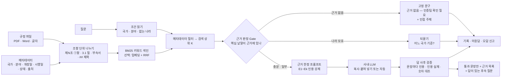

# 인증법규 Agent — 프로젝트 기획서

| 항목 | 내용 |
|---|---|
| 리포 | data09-26 |
| 제출자 | 이기욱 (두 번째 과제 — 첫 과제는 data09-15 기술표준 검토의견 작성 Agent) |
| 직무·대상 | 건설기계 제품개발 · 영업 · 품질 부문 ↔ 인증팀 — 국가별 인증법규 문의 대응 |
| 과정 | 현장 데이터 디지털화 전문가과정 1차수 |
| 작성일 | 2026-09-30 |
| 문서 상태 | 초안 v0.2 (2026-09-30 오후) — 수강생 추가 요청으로 인증 분야에 사이버 보안(Cybersecurity) 추가(11장). v0.1: 패들릿 설계 본문 + Claude·ChatGPT 기획서 2종을 한 문서로 종합, 1단계 = 브라우저에서 도는 근거 한정 RAG(조항 단위 나누기 · BM25 · 근거 판정 · 인용 강제 프롬프트 · 답 사후 검증 · 되묻기 · 답이 있는 후속 질문 · 기록 · 골든셋), 2단계 = M365 폴더 연동 · 팀 공유 · 사내 LLM 자동 검증 · Python/팔란티어 운영 |

이 문서는 제출자가 패들릿 「프로젝트 기획 - 이기욱」 섹션에 올린 설계 본문(2026-09-30 08:52, `docs/source/패들릿_제출_원문.md`)과 첨부 두 문서를 과정 기획서 형식(10장)으로 합친 것입니다.

- `docs/source/인증법규_AI_Agent_아키텍처_보고서_Claude.docx` — Claude 로 작성한 아키텍처 보고서(설계 원칙 P1~P7, 방어선 D1~D8, 운영 플로우 F1~F6)
- `docs/source/인증법규_AI_Agent_기획서_ChatGPT.docx` — ChatGPT 로 작성한 구축 아키텍처·추진계획(7계층, Evidence Sufficiency Gate, 추가질문 유도, 표준 무응답 문구)

두 문서는 방향이 같고(근거 없으면 답하지 않는다), 서로 겹치지 않는 부분을 보완합니다. 아래에서는 두 문서의 같은 개념을 한 이름으로 묶고, 출처를 (C)=Claude 문서 · (G)=ChatGPT 문서로 표시했습니다.

## 1. 추진 배경과 현안

- 건설기계는 판매 국가마다 배출가스 · 안전 · 소음 · 전자기적합성(EMC) · 기능안전 · 사이버 보안 · 형식승인 인증 규제가 다르고, 규제는 계속 개정됩니다.
- 제품개발 · 영업 · 품질 부문의 인증 문의가 인증팀에 개별로 몰립니다. 제출 원문이 꼽은 비효율은 네 가지입니다.
  - **응답 지연** — 「A국 수출 시 필요한 인증은?」 같은 반복 문의가 병목
  - **지식의 편재** — 법규 원문 · 해석 · 과거 사례가 개인 PC · 메일 · 폴더에 흩어짐
  - **해석 편차** — 담당자마다 같은 규제에 다른 답
  - **개정 추적의 어려움** — 개정 · 시행일 변경이 현업에 늦게 전달됨
- 지식원(제출 원문): 인증법규팀이 정리한 전사 제품 인증법규 지식(사내 M365 · OneDrive 지식 폴더), 사외 인증법규 링크(EN474 등), 인증법규팀 사내 시스템, 인증팀의 문의 회신을 정리한 메일(워드로 저장).

## 2. 목표

### 2.1 최종 목표 (제출 원문)

| 번호 | 요구 | 두 문서의 설계 |
|---|---|---|
| ① | **할루시네이션 0 에 근접** — 근거가 없으면 「없음」으로 답 | 폐쇄 세계 지식(P1), 모든 문장에 출처(P2), 검증 후 출력(P3), 모르면 모른다(P4) (C) · Evidence Sufficiency Gate, 표준 무응답 문구 (G) |
| ② | **되묻기 · 후속 질문으로 질문을 구체화** | 핵심 조건이 모호하면 1회 되묻기, 「지식베이스에 실제로 답이 있는」 후속 질문만 제안(P6) (C) · 국가 · 제품 · 시점 · 인증영역 슬롯 추출과 추가질문(8장) (G) |
| ③ | 지식 폴더 관리 기능 | 지식 오너 · 문서 라이프사이클(초안 → 검수 중 → 운영 → 만료 임박 → 구버전 → 폐기), 메타데이터 규칙 (C·G) |
| ④ | 운영: Python 등으로 구현, **팔란티어(사내 지원팀)** 또는 **사내 PC** | 옵션 A Microsoft 중심 / 옵션 B 기존 엔터프라이즈 AI 플랫폼 중심 (C) · Azure OpenAI 또는 내부 LLM (G) |

제출 원문의 「정직한 전제」도 그대로 받아들입니다 — LLM 의 확률적 오류를 이론적으로 0 으로 보장할 수는 없으므로, **환각이 사용자에게 도달하지 못하도록 구조로 막고**(Gate · 검증기 · 고정 거절 문구), 남는 위험은 출처 표시와 인증팀 확인으로 관리합니다.

### 2.2 1단계 목표 (이 리포)

- **「틀린 답을 하지 않는 구조」를 먼저 완성**합니다(ChatGPT 문서 18장의 권고). 국가 · 지식 범위 확대는 그다음입니다.
- 1단계는 두 문서의 Phase 1 PoC(1~2개 국가 · 1~2개 인증 분야로 끝에서 끝까지)와 같은 범위를, **설치 없이 사내 PC 브라우저에서** 돌게 만듭니다(운영 기준 ④의 「사내 PC」안). 같은 제출자의 첫 과제(data09-15)가 폐쇄망 로컬 도구였던 것을 따라, 인터넷 · 서버 · 외부 CDN 없이 `index.html` 더블클릭(file://)으로 돕니다.
- AI 는 **사내에서 허용한 LLM** 을 씁니다. 기본은 프롬프트 복사 → 붙여 넣기(반자동)이고, 사내 LLM 이 OpenAI 호환 API 를 열어 두었다면 주소(Base URL) · 모델만 적어 자동으로 보냅니다. 코드에는 어떤 외부 주소 · 키도 없습니다.
- **LLM 없이도 동작하는 부분이 방어선의 대부분**입니다 — 조항 나누기, 검색, 근거 판정(거절), 되묻기, 후속 질문 확인, 답 사후 검증은 모두 도구가 규칙으로 합니다. LLM 은 근거 조항을 문장으로 정리하는 데만 씁니다(P1 「언어 이해 · 요약 · 표현 용도로만」).
- 샘플은 **가상 규정**입니다(알파국 · 베타국 · 감마연합, 숫자도 지어냄). 실제 규정 원문은 리포에 넣지 않습니다(EN 표준 등은 저작물).

## 3. 보유 데이터 (지식원)

| 지식원 | 형태(제출 원문 · 두 문서) | 1단계에서 |
|---|---|---|
| 인증법규팀 지식 폴더 | 사내 M365(SharePoint · OneDrive) 지정 폴더. (G) 5.1 이 제안한 구조: 01_법규 · 02_인증제도 · 03_시험기준 · 04_환경/배출 · 05_사내지식 · 06_변경관리 | 폴더에서 받은 파일을 넣음 — PDF(글자 층) · Word(.docx) · 글자(.txt · .md). 메타데이터는 넣을 때 직접 적음 |
| 사외 인증법규 링크 | EN474 등 국가별 공식 인증정보 링크(별도 승인 목록) | 링크를 「출처」 칸에 적음. 링크 내용 자동 수집(스냅샷)은 2단계 |
| 인증팀 회신 메일 | 문의 지원요청 해결 방안을 정리한 메일(워드 저장) | Word 로 넣으면 문단 · 「## 제목」 단위로 나눔 |
| 인증법규팀 사내 시스템 | 형태 미확인 | 10장 확인 필요 |
| 실제 질문 예시 | (G) 부록 A 5개, (C) 5.2 예시 | 골든셋 형식으로 받을 수 있게 준비(4번째 화면) |

받은 첨부는 설계 문서 두 개뿐이라, 실제 규정 파일 · 폴더 구조 · 질문 기록은 아직 없습니다(10장).

## 4. 해결 방안 개요

두 문서의 방어선을 1단계 기능에 대응시키면 다음과 같습니다.

| 방어선 (C 5장) | 1단계 구현 | 남은 것(2단계) |
|---|---|---|
| D1 폐쇄 지식 | 넣어서 「운영」으로 둔 문서만 검색. 프롬프트가 근거 밖 지식 사용을 금지 | 승인 폴더 자동 연동 |
| D2 조항 단위 청킹 | 조문형(제N조 · ①항, 부칙 · 별표) · 절 번호형(3.1 · A.1 · 부속서) · 제목형(#) · 문단형 자동 판별. 장 · 상위 절 제목을 위치로 보존, 각 호(1. 2.)는 그 조 안에 둠, PDF 쪽 번호 보존 | 표 · 스캔(OCR) |
| D3 검색 Gate | 질문의 핵심 낱말이 근거(본문 + 그 문서의 국가 · 분야 · 제목)에 있는 비율로 충분 · 일부 · 없음. 최소 검색 점수. 지식베이스에 없는 나라를 물으면 바로 거절 | 재랭커 · 임계값 튜닝(실제 골든셋으로) |
| D4 근거 제한 생성 | 근거 조항만 넣은 프롬프트, 모든 문장에 [E번호] 필수, 숫자 · 단위 원문 그대로, 근거 안 지시문 무시(프롬프트 주입 방어) | JSON 스키마 출력 |
| D5 검증기 | 문장마다 ① 인용이 있는가 ② 이번 근거에 있는 인용인가 ③ 문장의 숫자가 **인용한 조항 안에** 있는가. 걸린 문장은 빼고, 사실 문장이 하나도 안 남으면 전체 거절 | 문장 함의(NLI) 검사 · 검증용 LLM 분리 |
| D6 고정 거절 템플릿 | 근거 없음은 AI 가 아니라 도구가 고정 문구(「근거 없음 — 인증팀 확인 필요」)로 냄. 그때는 AI 를 부르지 않음 | — |
| D7 시간 유효성 | 구버전 문서는 기본 제외(설정에서 켤 때만, 「구버전」 표시), 시행 전 · 오래된 자료(기본 3년) 주의를 근거와 프롬프트에 표시 | 시행일 도래 자동 전환 · 개정 감지 |
| D8 인간 검수 루프 | 모든 질문 · 근거 · 판정 · 답 · 검증 결과 기록, 도움됨 · 오답 신고, 근거 없음 낱말 집계(F4), 골든셋 점검 | 인증팀 검토 큐 · 공유 |

## 5. 주요 기능 — 1단계 / 2단계

| 요청 · 설계 항목 | 단계 | 1단계에서 한 것 / 미룬 이유 |
|---|---|---|
| 지식 문서 넣기 | **1단계** | PDF(vendor 의 pdf.js, 글자 층 있는 것) · Word(.docx, vendor 의 JSZip) · .txt · .md · 글자 붙여 넣기. 파일은 브라우저 안에서만 읽음. 넣기 전 나누기 미리보기(방식 · 조각 수 · 앞 6개) |
| 메타데이터 | **1단계** | 문서 코드(인용 ID 머리) · 이름 · 국가(「공통(사내)」은 어느 나라 질문에도 함께) · 인증 분야(배출가스 · 안전 · 소음 · EMC · 기능안전 · 사이버 보안(Cybersecurity) · 형식승인 · 기타 — 사이버 보안은 v0.2 추가) · 개정일 · 시행일 · 상태(운영 · 검수 중 · 구버전) · 출처. 파일에서 추정하지 않고 직접 적음 |
| 조항 단위 나누기 | **1단계** | 4장 D2. 조각 ID = 「문서코드 조항」(예: `ALP-EM-2025 제3조 ①`) — 답의 인용 · 기록 · 골든셋이 모두 이 ID 를 씀. 1,200자 넘는 조항만 문장 경계에서 (1/2)(2/2) |
| 검색 | **1단계** | BM25(한글은 두 글자씩, 영문 · 숫자는 통째로 — 형태소 분석기 없이 조사에 흔들리지 않게). 메타데이터 필터를 먼저 적용. 선택: 사내 서버의 `/embeddings` 로 조각 벡터를 만들어 키워드 순위와 합침(RRF) |
| 근거 판정 · 거절 | **1단계** | 4장 D3 · D6. 판정 이유(근거에 없는 낱말 등)를 화면에 보여 줌 |
| 되묻기 | **1단계(국가)** | 국가를 말하지 않았는데 근거가 여러 나라에서 비슷한 점수로 나오면 답 전에 「어느 국가 기준?」. 기종 · 판매 시점 되묻기는 2단계(메타데이터에 기종 · 적용 시점이 생긴 뒤) |
| 근거 한정 프롬프트 · AI | **1단계(반자동 + 선택 자동)** | 복사 → 사내 AI 에 붙여 넣기 → 답 붙여 넣기. 선택: OpenAI 호환 주소 · 모델 · 키(선택)를 설정하면 「설정한 AI 서버로 보내기」. 키는 코드 · 리포에 없고 「기억」을 고를 때만 이 브라우저에 저장 |
| 답 사후 검증 | **1단계** | 4장 D5. 문장별 통과 · 표시 · 이유, 사용자용 답은 통과 문장만 + 「일부 문장은 근거와 대조되지 않아 뺐습니다 — 근거 없음 — 인증팀 확인 필요」. 답과 근거 목록 함께 복사 |
| 후속 질문 | **1단계** | 심화(가장 관련 높은 조항의 앞뒤 조항) · 범위 확장(같은 나라 다른 분야) · 비교(같은 분야 다른 나라). **후보마다 검색 · 판정을 다시 돌려 「충분」인 것만** 보여 줌(C 6.2 「답변 가능성 사전 검증」). 근거 없음일 때도 「대신 확인할 수 있는 주제」로 |
| 기록 · 미응답 | **1단계** | 모든 질문을 기록(판정 · 근거 조항 ID · 점수 · 답 · 검증 결과 · 피드백). 근거 없음 / 표시됨 / 오답 신고 / 되묻기로 거르기, 근거가 없던 낱말 집계(C 10.5 F4), CSV |
| 골든셋 점검 | **1단계** | 「질문 \| 정답 조각 ID」 · 「질문 \| 거절」 줄로 적고, AI 없이 Recall@K 와 정직한 거절률을 잼(C 8장). 샘플 12문항: 재현율 100% · 거절 100% (테스트로 고정) |
| 설정 · 백업 | **1단계** | 상위 K · 충분/일부 비율 · 최소 점수 · 함께 넣을 조항 하한 · 오래된 자료 기준 · 구버전 포함, AI 연결, 벡터, JSON 백업 |
| M365 지정 폴더 자동 연동 | **2단계** | Microsoft Graph 변경 감지는 사내 계정 · 권한 · 서버가 필요(브라우저 단독으로는 불가). 1단계는 파일을 받아 넣는 방식 |
| 사외 링크 스냅샷 · 개정 감지 | **2단계** | 승인 URL 목록(Approved Source Registry)을 받아 스냅샷 · 해시 비교. 표준 원문(EN 등)은 저작물이라 요약 · 해설만 넣을지 확인 필요(10장) |
| 팀 공유 · 권한 | **2단계** | `supabase/schema.sql`(문서 · 조각 · 질의 기록 · 피드백 · 골든셋, 본인 행만 RLS, 기록은 고치거나 지울 수 없음)과 로컬 검증 하네스는 준비함. 인증팀이 올리고 현업이 읽는 그룹 권한 · Entra ID 연동은 사내 기준 확인 후 |
| 검증 강화 | **2단계** | 문장 함의(NLI) · 검증용 LLM 분리(C 7장 설계 권고), 재랭커, JSON 스키마 답 |
| Python · 팔란티어 운영 | **2단계** | 로직(`js/logic.js`)이 화면과 분리돼 있어 같은 규칙을 Python 으로 옮기기 쉬움. 운영 환경이 정해지면(10장) 그쪽으로 이식 |
| 스캔 PDF · HWP | **2단계** | OCR · HWP 변환 필요. 1단계는 PDF · Word 로 저장해 넣도록 안내 |

## 6. 기대 산출물

1. **인증법규 Agent(웹, 1단계)** — https://aebonlee.github.io/data09-26/ (「가상 샘플 규정으로 시작」으로 바로 둘러볼 수 있음). 폐쇄망에서는 리포를 ZIP 으로 받아 `index.html` 더블클릭
2. **로직과 테스트** — `js/logic.js`, `test/logic.test.mjs`: 조항 나누기(조문형 · 절 번호형 · 제목형 · 문단형 · 쪽 · 긴 조), BM25(순위 · IDF · 필터), 조건 읽기, Gate(골든셋 · 거절 · 구버전 · 시행 전 · 되묻기 · 공통 문서), 프롬프트, 답 사후 검증(통과 · 인용 없음 · 없는 인용 · 숫자 · 거절), 후속 질문, 기록, PDF · DOCX 글자 꺼내기, 임베딩 요청
3. **가상 샘플** — `js/sample-data.js` 6개 문서 · 골든셋 12문항, `samples/`(같은 글을 PDF · Word · txt · md 파일로 — 파일로 넣어도 같은 조각이 나오는지 확인)
4. **DB 스크립트** — `supabase/schema.sql` + 로컬 검증 하네스(`scripts/sqltest/`)

## 7. 기술 구성

| 과정 도구 | 이 프로젝트에서 쓰는 곳 |
|---|---|
| DAY1 암묵지 자산화 · 전략기획 | 인증팀 회신 메일 · 해석을 지식 문서로 넣어 담당자 머릿속 기준을 문서화 |
| DAY2 코랩(Python) · 바이브코딩 | 조항 나누기 · 검색 · 검증 로직과 화면 — 2단계 Python 이식의 바탕 |
| DAY3 멀티모달 비정형 정보화 | PDF · Word 에서 글자 · 쪽 · 표 꺼내기 |
| DAY4 RAG | **이 프로젝트의 중심** — 조항 단위 청킹, BM25(+선택 벡터), 근거 판정, 인용 강제, 사후 검증, 골든셋 |
| DAY5 Make 자동화 | (2단계 후보) 지식 폴더 변경 → 재색인 · 개정 알림 |

- 정적 웹(HTML · CSS · 일반 스크립트), `index.html` 을 더블클릭해도 열립니다. PDF 는 `vendor/pdf.min.js`(pdf.js, 넣을 때만 불러옴, 한글 글꼴표 `vendor/cmaps/`), Word 는 `vendor/jszip.min.js`. 외부 CDN 없음.
- 저장은 localStorage `data09-26.db` 한 칸(문서 · 조각 · 기록 · 설정 · 벡터), AI 연결 설정은 `data09-26.ai`. 브라우저 저장소는 보통 5MB 안팎이라 문서가 많아지면 2단계 DB 가 필요합니다.

## 8. 개발 단계

### 1단계 — 브라우저 근거 한정 RAG (완료, 2026-09-30)

- 문서 넣기 · 메타데이터 · 조항 나누기, BM25 검색(+선택 벡터), 근거 판정 · 고정 거절, 국가 되묻기, 근거 한정 프롬프트(반자동 · 선택 자동), 답 사후 검증, 답이 있는 후속 질문, 기록 · 미응답 · 오답 신고, 골든셋 점검, 가상 샘플, DB 스키마 · 검증 하네스

### 2단계 — 사내 운영

- [ ] 실제 문서 · 실제 질문으로 골든셋을 만들어 판정 기준 조정(거절이 너무 많거나 적은지)
- [ ] 운영 환경 결정(팔란티어 / 사내 PC · 사내 서버)에 맞춰 로직을 Python 으로 이식하거나 서버 API 로
- [ ] M365 지정 폴더 연동(변경 감지 → 재색인), 사외 링크 스냅샷 · 개정 감지
- [ ] 팀 공유: 인증팀이 문서 등록 · 승인(스테이징 → 운영), 현업은 읽기 · 질문, 피드백이 인증팀 검토 큐로
- [ ] 검증 강화: 문장 함의 검사 · 검증용 LLM 분리, 기종 · 적용 시점 슬롯과 되묻기
- [ ] 표 · 스캔 PDF(OCR) · HWP

## 9. 기대 효과

- **반복 문의의 1차 응답** — 현업이 근거 조항 · 개정일과 함께 바로 확인하고, 없는 것은 「근거 없음」으로 분명히 받습니다.
- **틀린 답이 나가지 않는 구조** — 근거 없는 질문은 AI 를 부르지 않고, AI 의 답도 인용 · 숫자가 맞는 문장만 보여 줍니다.
- **채울 지식이 보임** — 근거 없음 질문과 그 낱말이 쌓여 인증팀이 무엇부터 문서화할지 알 수 있습니다.
- **해석 편차 감소** — 같은 문서 · 같은 규칙으로 찾고, 조항 ID 로 근거를 공유합니다.

실제 절감 시간은 측정 전이라 적지 않습니다.

## 10. 확인 필요 사항 (수강생께)

1. **운영 환경** — 제출 원문의 두 안(팔란티어 관리팀 지원 / 사내 PC) 가운데 1단계는 **사내 PC 의 브라우저에서 설치 없이** 도는 쪽으로 만들었습니다. 원문의 「Python 등으로 구현」은 로직을 분리해 두어 2단계에 옮기기 쉽게 했습니다. 첫 과제(data09-15)처럼 **Python 로컬 도구**가 꼭 필요한지, 팔란티어 쪽 지원이 언제 · 어떤 형태(AIP 등)로 가능한지 알려 주세요.
2. **사내 LLM** — 쓸 수 있는 AI 가 무엇인가요(사내 승인 LLM · Azure OpenAI · 팔란티어 AIP · 외부 ChatGPT 금지 여부)? 「OpenAI 호환 API」 주소가 있으면 자동 보내기가 되고, 브라우저에서 부르려면 서버가 CORS 를 허용해야 합니다. 원문의 「국핵기 기반은 아니나 사내 지식으로 한정」이 외부 AI 에 규정 조각을 보내도 된다는 뜻인지도 확인 부탁드립니다.
3. **지식 폴더 문서 형식 · 분량** — PDF(글자 층 / 스캔) · Word · HWP · 엑셀 표 중 무엇이 많은가요? 문서 수 · 쪽수는 대략 얼마인가요? 브라우저 저장소(약 5MB)를 넘으면 2단계 DB 가 먼저 필요합니다. 비밀이 아닌 문서 한두 개(또는 목차만)를 받으면 조항 나누기를 그 형식에 맞추겠습니다.
4. **메타데이터 규칙** — 파일 이름이나 폴더에 국가 · 분야 · 개정일 · 시행일이 들어가는 규칙이 있나요? 있으면 넣을 때 자동으로 채우겠습니다. 인증 분야는 2026-09-30 답변으로 사이버 보안을 더해 8가지(배출가스 · 안전 · 소음 · EMC · 기능안전 · 사이버 보안 · 형식승인 · 기타)가 되었습니다(11장). 그 밖에 더하거나 나눌 분야가 있으면 알려 주세요.
5. **인증팀 회신 메일(워드)** — 메일 한 통 = 문서 하나인가요, 여러 통을 한 파일에 모았나요? 질문/답 형식이 있으면 「## 질문」 단위로 나눠 과거 사례로 찾게 하겠습니다.
6. **사외 링크(EN474 등)** — 승인 목록이 어떤 형태인가요? EN · ISO 표준 원문은 유료 저작물이라 원문을 지식베이스에 복제해도 되는지(사내 구독 · 라이선스), 아니면 인증팀 요약 · 해설만 넣을지 정해 주세요.
7. **인증법규팀 사내 시스템** — 어떤 시스템이고 내보내기(엑셀 · API)가 되나요?
8. **실제 질문 10~20개** — 자주 오는 문의와 정답 근거(문서 · 조항)를 주시면 골든셋으로 판정 기준(충분 비율 0.66 · 일부 0.34 · 최소 점수 0.5)을 맞추겠습니다. 「답하면 안 되는 질문」도 몇 개 부탁드립니다.
9. **국가 목록 · 표기** — 대상 국가와 표기(예: EU / 유럽 / 독일을 어떻게 나눌지, 북미 주별 규정)를 알려 주세요. 지금은 지식베이스에 없는 실제 국가를 물으면 거절합니다.
10. **되묻기 범위** — 지금은 국가만 되묻습니다. 기종(굴착기 · 휠로더 · 톤급) · 판매 시점(시행일 비교)도 되묻기를 원하시면 문서 메타데이터에 적용 기종 · 적용 기간 칸을 더하겠습니다.
11. **사용자 · 공유** — 1단계는 한 사람의 브라우저에 저장됩니다. 인증팀이 문서를 올리고 현업이 읽는 공유가 필요하면 사내에서 쓸 수 있는 DB · 로그인(Entra ID 등)을 알려 주세요.

## 11. 2026-09-30 수강생 추가 요청 반영

### 11.1 요청 원문

> **보완 필요 사항 : 인증 분야 조건 출력관련** (2026-09-30 04:02 UTC, 패들릿)
> 기존 정리는 잘 되어 있습니다. 다만 현재 이슈로 이후 관리가 될 항목으로 "시어버 보안"이 추가되면 좋겠습니다

(「시어버 보안」은 「사이버 보안」의 오타로 읽었습니다. 원문 저장: `docs/source/2026-09-30_패들릿_추가요청.md`)

10장 질문 4(인증 분야 7가지가 맞나요?)에 대한 답으로 보고, **나머지 분야는 확인됨 + 사이버 보안 추가**로 확정했습니다.

### 11.2 반영 방식

| 자리 | 바꾼 것 |
|---|---|
| 분야 목록(`js/logic.js` FIELDS) | `사이버 보안` 추가 — 저장값은 한글, 화면 · 프롬프트에는 **「사이버 보안 (Cybersecurity)」** 로 표시. 문서 메타데이터의 분야 고르기, 질문하기의 「인증 분야 조건」 거르기, 문서 목록 · 근거 카드 · 판정 조건 줄에 모두 나옵니다 |
| 질문에서 분야 읽기 | 사이버 · 보안 · Cybersecurity · 해킹 · 취약점 · 침해 · 악성코드 · 소프트웨어 업데이트 · 무선 업데이트 · 펌웨어 · SBOM · 소프트웨어 구성 명세 · 암호화 · 접근 통제 · 원격 접속 → 사이버 보안. **다른 분야보다 먼저** 보므로 「원격 접속 보안 안전 요건」처럼 「안전」이 섞여도 사이버 보안으로 읽습니다 |
| 다른 표기 맞추기 | 백업 · 파일에서 「사이버보안」 · 「Cybersecurity」 · 「cyber security」로 적힌 분야도 사이버 보안으로 저장(목록 밖 값은 종전대로 「기타」) |
| DB(`supabase/schema.sql`) | `kb_document.field` 허용 값에 `사이버 보안` 추가. 이름 붙은 제약(`kb_document_field_check`)을 지우고 다시 만드는 방식이라 **이미 만든 DB 에 다시 실행해도** 새 목록이 됩니다. 화면 목록과 DB 목록이 같은지 테스트가 대조합니다 |
| 가상 샘플 | 사이버 보안 가상 문서 2개 추가 — `BET-CS-2026` 베타국 건설기계 사이버 보안 요건(조문형: 취약점 관리 · 소프트웨어 업데이트 · 접근 통제 · SBOM · 보안 지원 기간), `GAM-CS-2026` 감마연합 이동식 기계 사이버 보안 지침(절 번호형: 통신 암호화 · 보안 기능 보호 · 보안 사고 보고 · 기록 보관, 시행 전 문서). 나라 · 조항 · 숫자 모두 지어낸 것이며 실제 규정 문장이나 번호를 옮기지 않았습니다. 가상 샘플은 6개 → 8개 |
| 골든셋 · 예시 질문 | 정답 3문항(베타국 취약점 평가 기한 · 무선 업데이트 설치 전 확인 · 감마연합 보안 사고 보고 기한) + 거절 1문항(알파국 사이버 보안 — 알파국에는 사이버 보안 문서가 없음) 추가 → 16문항(정답 11 · 거절 5). 예시 질문에 「베타국 소프트웨어 업데이트 보안 요건은?」 추가 |

### 11.3 참고 — 실제 규제 동향에 대해

건설기계를 포함한 기계류에 사이버 보안 요건이 새로 들어오는 흐름이 있다는 것이 이번 요청의 취지로 보입니다. 다만 어느 나라의 어떤 규정이 언제부터 건설기계에 적용되는지는 이 기획서에서 확인하지 않았으므로 **규정 이름 · 조항 번호 · 시행일을 적지 않습니다.** 실제 문서는 인증팀이 확보한 원문을 「② 지식 문서」에 분야 「사이버 보안」으로 넣으면 같은 방식(근거 한정 · 인용 · 거절)으로 답합니다.

### 11.4 남은 확인

- 사이버 보안 문서의 **형식** — 규정 본문 외에 사내 보안 점검표 · SBOM 목록(엑셀) 같은 표 자료도 근거로 쓰실 계획인가요? 표는 지금 「칸 | 칸」 줄로만 들어가므로, 많다면 표 전용 나누기를 2단계에 넣겠습니다.
- 질문에서 분야를 읽는 낱말(11.2) 가운데 **「보안」 · 「암호화」가 다른 뜻으로 자주 쓰이는지**(예: 물리 보안 · 도난 방지) 알려 주세요. 그렇다면 그 낱말은 분야 판별에서 빼겠습니다.
- 사이버 보안을 다시 나눌지(예: 차량 통신 · 원격 관리 · 제어기 소프트웨어) — 지금은 한 분야입니다.

## 부록. 제출 원문 요약

| 출처 | 파일 | 내용 |
|---|---|---|
| 패들릿 게시물 「[2] 인증법규 Agent」 (2026-09-30 08:52) | `docs/source/패들릿_제출_원문.md` | 설계 본문(Claude 보고서 1~2장과 같은 글) + 제출자 메모: 지식원 4가지, 할루시네이션 0 근접, 「없음」 답 + 되묻기, 지식 폴더 기능, Python 구현 · 팔란티어 또는 사내 PC 운영 |
| 첨부 — Claude 기반 아키텍처 보고서 | `docs/source/인증법규_AI_Agent_아키텍처_보고서_Claude.docx` | 원칙 P1~P7 · 6계층 · 질의응답 8단계 · 방어선 D1~D8 · 답변 3분기 · 후속 질문 사전 검증 · 기술 옵션 A/B · 골든셋 지표 · 운영 플로우 F1~F6 · Phase 0~4 · 강사 논의 포인트 5 |
| 첨부 — ChatGPT 기반 구축 아키텍처 · 추진계획 | `docs/source/인증법규_AI_Agent_기획서_ChatGPT.docx` | 원칙 ①~⑦ · 7계층 · M365 폴더 구조 · Approved Source Registry · Ingestion/Retrieval · Evidence Sufficiency Gate 7항목 · 표준 무응답 문구 · 추가질문 유형 7 · KPI 7 · Red Team 8 · 로드맵 5단계 |

두 문서의 「강사 논의 포인트」(C 14장)에 대한 1단계의 답:

- **환각 0 을 구조로?** — 그렇게 했습니다. 거절은 도구의 고정 문구, 답은 인용 · 숫자 대조를 통과한 문장만.
- **정확도–커버리지 트레이드오프** — 판정 기준을 설정에서 바꾸고, 골든셋 점검(재현율 · 정직한 거절률)으로 바꾼 결과를 바로 봅니다.
- **조항 단위 청킹 · 하이브리드 검색의 효과 검증** — 골든셋의 Recall@K 로 잽니다. 샘플에서는 BM25 만으로 100% — 실제 문서로 다시 재야 합니다.
- **답변 가능성이 검증된 후속 질문** — 후보마다 검색 · 판정을 다시 돌려 통과한 것만 보여 줍니다.
- **평가 체계의 소유** — 골든셋 줄 형식을 인증팀이 직접 고칠 수 있게 두었습니다(2단계에서 공유 DB 의 `golden_question`).
